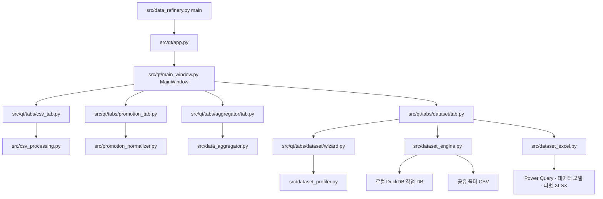

# AI 코드맵 — Data Refinery

현재 구현의 진입점, 책임과 변경 계약을 설명합니다. 과거 검증 기록은 품질 계획·릴리스 노트를 참고합니다.

## 1. 앱 실행과 버전

- 기본 UI: PySide6(Qt), `src/qt/`의 네 가지 업무 탭.
- 개발 실행: `python -m src.data_refinery` 또는 `run_app.bat`.
- 버전 표시: `python -m src.data_refinery --version`.
- 레거시 UI: `python -m src.data_refinery --legacy-tk`. Tkinter 호환 소스·테스트는 유지합니다.
- 앱 버전의 유일한 정의: `src/version.py`의 `__version__`.
- CLI·Qt·Tkinter는 같은 버전을 import하고, spec·빌드·설치 검증은 `version.py`를 읽습니다.
- 고정 의존성: `requirements.txt` (Python 3.13, PySide6 Essentials, pandas, DuckDB, openpyxl, Windows Excel COM, PyInstaller).

## 2. 설치와 저장 경로

| 용도 | 경로 | 소유 코드 |
| --- | --- | --- |
| 앱 설치·번들 라이브러리 | **`%LOCALAPPDATA%\Programs\Data Refinery`** | `installer/setup.iss` |
| 설정·최근 작업·진단 로그 | `%LOCALAPPDATA%\Programs\Data Refinery\UserSetting` | `src/app_paths.py` (`update_checker.application_data_directory()` 호환 wrapper) |
| 데이터셋 설정·로컬 DuckDB 작업 DB | `%LOCALAPPDATA%\Programs\Data Refinery\UserSetting\datasets` | `src/dataset_config.py`의 `get_default_storage_dir()` |
| 공개 CSV·Excel 템플릿 | 데이터셋에 지정한 공유 배포 폴더 | `src/dataset_engine.py`, `src/dataset_excel.py` |

설정·로그·데이터셋은 설치 폴더 안의 `UserSetting`에 통일합니다. `src/app_paths.py`가
경로를 관리하며 기존 로컬 자료를 최초 실행 시 복사·검증합니다. 원본은 보존하고
기존 새 자료를 우선하며 완료 표식으로 재이관을 막습니다. 설치 AppId·Excel 연결은 유지합니다.
이름·저장소 구조와 정리 범위는 [프로젝트 구조 규칙](docs/project-structure.md)을 따릅니다.

## 3. 실행 흐름



## 4. 주요 모듈 책임과 변경 계약

| 모듈 | 책임 | 변경 시 주의 |
| --- | --- | --- |
| `src/data_refinery.py` | CLI 진입점·Qt/레거시 선택, 기존 Tkinter 화면 | 기본은 Qt, 버전은 `src.version`에서 import |
| `src/qt/app.py` | QApplication·폰트·테마·자산 경로 초기화 | 개발/번들 자산 탐색을 함께 유지 |
| `src/qt/main_window.py` | 네 탭·언어·메뉴·업데이트 확인 | 업무 엔진과 화면 책임 분리 |
| `src/qt/jobs.py`, `src/background_jobs.py` | Qt 타이머 연동·백그라운드 실행·콜백 | UI 갱신은 UI 스레드에서 수행 |
| `src/csv_processing.py` | CSV/TXT/Excel 파싱·숫자·인코딩·안전한 출력 | 원본 덮어쓰기·불완전한 결과 파일 방지 |
| `src/promotion_normalizer.py` | 프로모션 입력 검증·정규화·일별 출력 | 압축 기준 규칙과 일별 분석 결과를 구분 |
| `src/data_aggregator.py`, `src/aggregator_fields.py` | 대용량 집계·수식·필터·필드 상태 | 업무 로직을 UI로 이동하지 않음 |
| `src/preset_manager.py`, `src/session_memory.py` | 프리셋·파일별 최근 집계 설정 | 손상된 편의 설정은 주 작업을 막지 않음 |
| `src/qt/tabs/dataset/tab.py` | 배포 탭·누적·검수 승인·공개·Excel 생성 | 긴 작업의 중복 실행·설정 변경 차단 |
| `src/qt/tabs/dataset/wizard.py` | 파일 선별·역할 추천·복합키 진단 | 단계 이동 전 필수값 검증, 표본 진단을 전체 검증과 구분 |
| `src/dataset_profiler.py` | 표본 기반 타입·역할 추천 | 대용량 전체 로드 없이 분석 |
| `src/dataset_config.py` | DatasetDefinition·DatasetRegistry·배포 경로 | 같은 배포 폴더 중복 등록 차단, 스키마 변경 시 승인 무효화 |
| `src/dataset_engine.py` | 기간 누적·교체·검수·승인·CSV 공개 | 아카이브된 이전 기간 보존, 반쪽 기간 교체 차단 |
| `src/dataset_excel.py` | Excel COM으로 연결·데이터 모델·피벗 XLSX 생성 | 제작자 Excel 필요, 소비자는 추가 설치 불필요 |
| `src/data_mapper.py`, `src/mapper_ui.py` | 규칙 매핑 엔진·별도 Tkinter 화면 | 기능 소스 보존, 현재 기본 네 탭에는 매핑 화면이 연결되지 않음 |
| `src/app_paths.py` | 설치·UserSetting 경로·기존 자료 이관 | 원본 보존·사본 해시 검증·DB 사용 중 차단·반복 이관 방지 |
| `src/update_checker.py` | GitHub 릴리스 조회·업데이트 설정 | 네트워크 실패가 자료 처리 실패로 이어지지 않게 함 |
| `src/data_refinery_launcher.py` | 설치 앱 탐색·공식 설치 파일 다운로드·서명 확인 | 공식 URL·파일명·서명자 검증 유지 |
| `src/diagnostics.py`, `src/file_reveal.py` | 진단 ID·로그·결과 파일 찾기 | 원본 내용·민감한 경로를 로그에 노출하지 않음 |

레거시 화면은 `aggregator_ui.py`, `aggregator_dialogs.py`, `dataset_ui.py`, `ui_components.py`,
`ui_field_list.py`, `ui_dnd.py`를 사용합니다. 기본 Qt 화면과 별도로 유지하며, 앱의 언어 문자열은 `src/i18n.py`를 공유합니다.

## 5. 데이터셋 배포 계약

1. 파일·열·기준년월·키·수치·숫자 형식을 설정합니다. 프로파일러는 추천을 제공하며 실제 적재는 엔진이 검증합니다.
2. 새 월은 추가, 수정 월은 교체합니다. 같은 자료 재실행 시 중복 누적하지 않습니다.
3. 이전 입력을 아카이브해도 누적 과거 기간은 보존합니다. 수정 월 기여 파일 일부가 빠지면 교체를 차단합니다.
4. 검수 승인 후에만 공개합니다. 설정·입력이 바뀌면 기존 승인으로 배포하지 않습니다.
5. CSV 공개 실패 시 이전 공개본 복원을 시도합니다. 여러 파일을 갱신하므로 정전·네트워크 단절에서의 단일 트랜잭션을 보장하지 않습니다.
6. 표시 이름 변경 시 고정 CSV 이름은 유지합니다. 공유 폴더 경로 변경은 소비자 Excel 연결 변경을 요구합니다.
7. 소비자 Excel은 공유 CSV를 Power Query로 읽고 데이터 모델·피벗을 새로고침합니다. 로컬 작업 DuckDB를 공유 DB로 열지 않습니다.
8. 실환경 공유 드라이브의 파일 잠금·동시 접근은 별도의 수동 검증 항목입니다.

## 6. 자산·샘플·패키징

- 사용 중 아이콘: `assets/icons/icon.ico`.
- 문서 이미지: `assets/images/manual-data-refinery.png`, `manual-data-aggregator.png`, `manual-promo-normalizer.png`.
- 프로모션 템플릿: `assets/templates/promotion_template.xlsx`가 유일한 원본이며 UI에서 내보냅니다.
- 집계 예제: `sample_data/monthly_ledger_sample.csv`, `sample_data/sample_preset.json`.
- 자산은 개발 시 저장소 `assets/`, PyInstaller onedir에서는 `_internal/assets/`에서 찾습니다.
- 앱 spec: `installer/data_refinery.spec` (DuckDB·COM·필요 Qt 모듈 포함).
- 런처 spec: `installer/data_refinery_launcher.spec`.
- 설치 설계도: `installer/setup.iss`, 앱 식별자는 기존 값을 유지합니다. 번들·출력 폴더는 컴파일러 매개변수로 주입합니다.
- 빌드: `scripts/build.ps1` (앱·런처·미서명 설치 검증본), 서명·공식 스테이징·선택 게시: `scripts/sign.ps1`.
- 설치 파일: `App04_DataRefinery_Setup_v<version>.exe` 한 개 (과거 이름은 읽기 호환), 앱: `App04_DataRefinery_v<version>.exe`.
- 런처: `App04_DataRefinery_Launcher.exe` (과거 `Luncher` 오타 수정).
- `build/`, `dist/`, `release/`, `tools/`는 Git 제외입니다. 최신 공식 파일만 `release/`에, 서명 기록과 보호 파일은 `tools/release-history/`에 보관합니다.
- 릴리즈 노트 원본은 `docs/release-notes/`, 배포 절차는 `docs/releasing.md`에 있습니다. `SHA256SUMS.txt`는 자기 자신을 제외한 공식 폴더의 모든 파일을 포함합니다.

## 7. 검증 진입점

```powershell
python -m unittest discover -s tests -v
ruff check --select E4,E7,E9,F src tests
python -m src.data_refinery --version
```

Qt 테스트는 offscreen 실행을 포함합니다. Windows CI는 린트·테스트·미서명 빌드·설치/제거를 점검합니다.
`scripts/smoke_installer.ps1`은 임시 CI 러너 전용이며 설치된 GUI의 수동 사용성까지 검증하지 않습니다.
실제 Excel COM 테스트는 `DATAREFINERY_EXCEL_TESTS=1`로 활성화합니다. 최종 배포에는 별도의 서명·타임스탬프·체크섬 검증이 필요합니다.


## 2026-10-07 공통 정비 1단계

- 공통 기준·현재 예외: [SUITE_STANDARDIZATION.md](docs/SUITE_STANDARDIZATION.md).
- 수정·자동 검사·설치 흐름 소스 점검·후속 과제: [STANDARDIZATION_PHASE1_REVIEW.md](docs/STANDARDIZATION_PHASE1_REVIEW.md).
- `UserSetting/`, 로컬 환경 파일, 개인 키는 Git 제외 대상이며 실제 사용자 자료·기존 배포물은 유지합니다.

## 2026-10-07 공통 정비 2단계

- `installer/setup.iss`: `PrepareToInstall`에서 등록·경로·구형 EXE 해시를 기록하고, 추가 Restart Manager 리소스를 등록합니다. 첫 `BeforeInstall`에서 잠금 차단, `CurStepChanged(ssDone)`에서 새 EXE 해시 확인 후 사전 확인된 구형 leaf만 정리합니다. 현재·더 높은 버전 및 UserSetting은 보존합니다.
- `tests/test_installer_upgrade.py`: 설치를 진행하지 않는 Pascal 정책 시험. Application Control 차단은 실행 통과 대신 skip으로 구분합니다.
- 결과·한계: [STANDARDIZATION_PHASE2_REVIEW.md](docs/STANDARDIZATION_PHASE2_REVIEW.md).

## 2026-10-08 공통 정비 3–5단계

- 공개 역할 안내: docs/CODE_MAP.md, 백업·복원 계약: docs/USER_DATA.md.
- src/atomic_write.py: 고유 sibling 임시 파일 쓰기·flush/fsync·닫기·os.replace. 업데이트 설정, DatasetRegistry, 최근 작업과 프리셋에서 공유합니다. 실패 시 원본 직접쓰기 fallback이 없습니다.
- src/qt/main_window.py 메뉴는 실제 업데이트/저장소/About 항목에 맞춰 이름을 수정했습니다. src/i18n.py의 update_info_menu는 세 언어로 제공하고 상태줄 버전에서 구현 라이브러리 이름을 제거했습니다.
- scripts/build.ps1의 테스트 게이트에 공통 scripts/test_user_data_backup.ps1을 연결했습니다. LOCALAPPDATA/APPDATA는 검사 폴더로 격리합니다.
- tests/test_atomic_settings.py: flush·replace 실패, 다른 임시 파일 보존, 사용자 명시값 및 DB 정의 삭제 실패 시 DB 보존 검수.
- docs/project-structure.md의 사전 사용자 수정은 보존하고 설치 설계 참조 한 줄만 installer/setup.iss로 정정했습니다. 현재 역할은 공개 CODE_MAP에서 안내합니다.
- 자동 검증·미실행 실제 게이트: docs/STANDARDIZATION_PHASE3_5_REVIEW.md.
- 교차 검수 반영: DatasetRegistry._read_datasets_for_update는 저장/삭제 전에 기존 JSON·읽기 오류를 전파하여 빈 목록으로 원본을 덮어쓰지 않습니다. UI list_datasets의 조회 fallback은 유지합니다. 최종 전체 회귀 534개 실행, OK(2 skipped).
- 구조 문서의 이전 release 트리는 원문을 보존한 이전 메모로 표시하고 현재 installer/build/dist/release 역할 표를 별도로 추가했습니다.
- 최종 총괄 검수 반영: update_checker.save_settings는 기존 settings.json을 UTF-8 JSON object로 확인한 후 저장합니다. 읽기/형식 실패는 OSError로 차단하여 표시용 기본값으로 손상 원본을 덮어쓰지 않습니다. 테스트는 원본 JSON/UTF-8/권한 오류별 바이트 보존을 확인합니다.
최종 일반 settings.json 보호 반영 후 전체 격리 회귀 535개 실행, OK(2 skipped).
- 마지막 교차 검수 반영: session_memory는 손상·잘못된 entry를 고유 .bak에 flush/fsync하고 원본 bytes와 비교한 후 편의 복구합니다. 사본/읽기 실패는 본 업무를 실패시키지 않고 저장을 건너뜁니다. 일반 JSON writer 전체에 형식 guard를 넣지 않아 preset 명시 overwrite·legacy list는 유지합니다. 최종 전체 격리 회귀 536개 실행 OK(2 skipped).
