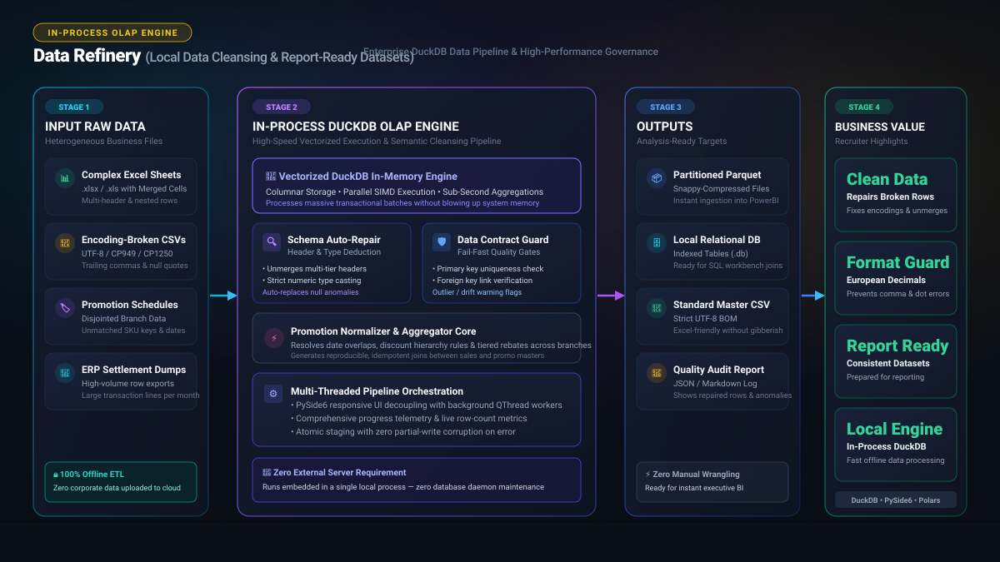
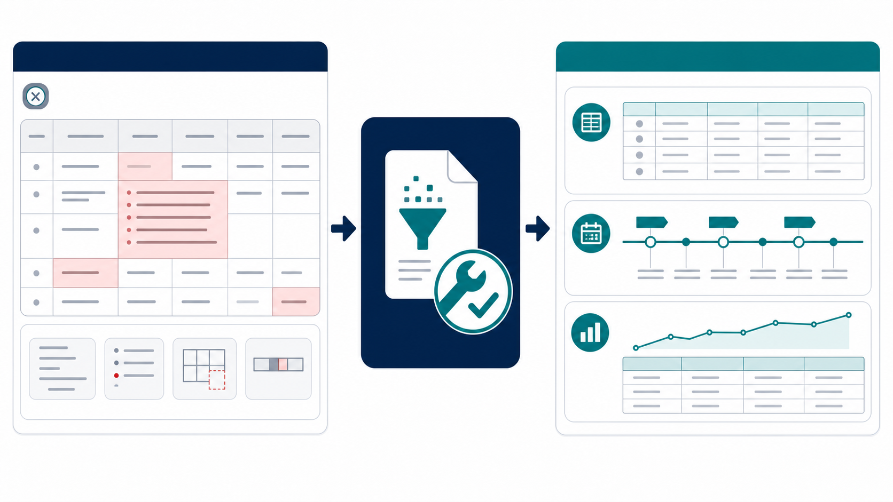

*Przeczytaj w innych językach: [English](README.md), [한국어](README.ko.md), [Polski](README.pl.md)*

# 💎 Data Refinery: Oczyszczanie danych biznesowych i przygotowanie zbiorów do raportowania

  

> **Czyszczenie danych źródłowych · Obsługa polskiego przecinka · Gotowe zbiory do raportów**

**Data Refinery** to aplikacja desktopowa stworzona w celu oczyszczania i normalizowania problematycznych plików źródłowych, przekształcając je w uporządkowane zbiory danych gotowe do raportowania i analiz.

W codziennej pracy zespoły finansowe i administracyjne często mierzą się z uszkodzonymi plikami CSV, błędnym kodowaniem znaków czy nakładającymi się okresami promocji. Głównym celem aplikacji jest automatyczna naprawa uszkodzonych wierszy, prawidłowe rozpoznawanie liczb z polskim przecinkiem dziesiętnym oraz generowanie spójnych szeregów czasowych i tabel gotowych do wykorzystania w raportach.

## Główne możliwości (v2.0.1)

- **Nowoczesny interfejs PySide6 (Qt)** — Nowoczesny interfejs zoptymalizowany pod kątem ekranów Hi-DPI w systemie Windows (motyw Primary Blue, czytelne karty, etykiety i kreatory krokowe). Zachowano opcjonalny tryb awaryjny `--legacy-tk`.
- **Kreator publikacji zbiorów danych (3-etapowy Wizard)**:
  - **Krok 1: Inteligentny wybór plików i filtry tagowe**: Błyskawiczne skanowanie plików CSV w folderze; filtry tagów `+ Uwzględnij (np. PL, sales)` oraz `- Wyklucz (np. backup)` z multiselekcją. Weryfikacja zgodności kolumn z bazowym schematem w czasie rzeczywistym.
  - **Krok 2: Profiler próbki 1 000 wierszy i Auto-Guess**: Błyskawiczna analiza pierwszego 1 000 wierszy w tle w celu automatycznego wykrywania kodowania znaków, separatorów i typów danych (Okres, Klucz, Wartość liczbowa, Ogólne).
  - **Krok 3: Detekcja kolizji kluczy złożonych**: Weryfikacja unikalności klucza złożonego na próbce przed załadowaniem pełnego zbioru.
- **Bezpieczna obsługa liczb europejskich (polski przecinek dziesiętny)** — Pełne zabezpieczenie przed zniekształceniem liczb zmiennoprzecinkowych (np. `1 234,56` lub `12,34`), eliminujące ryzyko 100-krotnego błędu skali przy konwersji przecinka na kropkę dzięki dedykowanemu silnikowi regex SQL.
- **Naprawa struktury CSV i uszkodzonych wierszy** — Odtwarzanie rekordów rozbitych przez nieujęte w cudzysłów znaki nowej linii, automatyczne wykrywanie separatorów i kodowań, odrzucanie wierszy o zbyt dużej liczbie kolumn z precyzyjną diagnozą numeru wiersza bez tworzenia częściowych plików wyjściowych.
- **Obsługa kodowania środkowoeuropejskiego (Polskie znaki diakrytyczne)** — Precyzyjne wykrywanie kodowań Windows-1250, ISO-8859-2 i CP852 z mechanizmem samonaprawczego odzyskiwania (Self-Healing) bez utraty reguł.
- **Normalizacja szeregów czasowych promocji** — Weryfikacja szablonów Excel (`Promotion_Master`, `Support_Rules`) i generowanie dziennych szeregów czasowych.
- **Agregacja danych** — Grupowanie wierszy CSV, zaawansowane filtry, funkcje agregujące dla poszczególnych kolumn, obliczanie miar pochodnych oraz zapisywanie reguł jako szablony wielokrotnego użytku.
- **Akumulacja w silniku DuckDB i publikacja** — Akumulacja comiesięcznych danych CSV w wydajnej bazie DuckDB, inspekcja sum kontrolnych okresów i kwot oraz publikacja zatwierdzonych migawek do plików CSV i szablonów Power Query w programie Excel.
- **Wielojęzyczność w czasie rzeczywistym** — Natychmiastowe przełączanie języka interfejsu: polski, angielski, koreański.
- **Szybka instalacja per-user** — Instalacja w katalogu `%LOCALAPPDATA%\Programs\Data Refinery` w architekturze `onedir` bez opóźnień związanych z rozpakowywaniem.

---

## 🚀 Pobieranie i instalacja

1. Przejdź do zakładki **[Releases](https://github.com/KwangBeomPark/04_DataRefinery/releases)**.
2. Pobierz instalator: **`App04_DataRefinery_Setup_vX.Y.Z.exe`** (oraz towarzyszący manifest `build-manifest.json` i sumę kontrolną `SHA256SUMS.txt`).
3. Uruchom instalator (nie wymaga uprawnień administratora, instaluje do profilu użytkownika).
4. Baza danych oraz przestrzeń robocza (`UserSetting\datasets`) są trwale chronione przed nadpisaniem podczas aktualizacji programu.

---

## 📄 Licencja

Projekt jest objęty licencją MIT. Szczegółowe informacje znajdują się w pliku [LICENSE](LICENSE).
